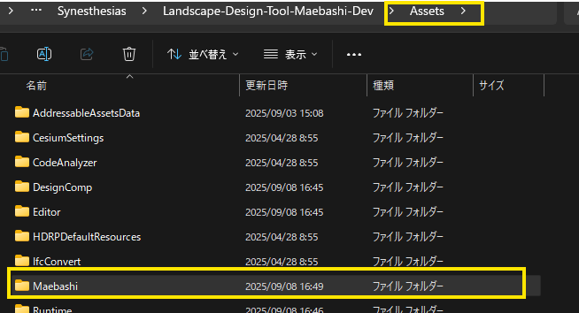

# セットアップの手順

本書では、本リポジトリのセットアップ手順について記載しています。

## Unityのダウンロードとインストール
- Unity Hub を[こちら](https://unity3d.com/jp/get-unity/download)からインストールします。
- Unity Hub とは、Unityのお好きなバージョンをインストールして起動することのできるソフトウェアです。
- Unity Hubを起動し、左のサイドバーからインストール → 右上のボタンからエディターをインストール をクリックします。


- Unity 2022.3.25f1 のバージョンを選択し、インストールを押します。
- 該当のバージョンが見つからない場合は、`アーカイブ` のタブを押して、`ダウンロードアーカイブ`のリンクより選択してください。


## プロジェクトのセットアップ
- 本プロジェクトをgithubよりクローンしてください。

### 前橋データのダウンロード
- 本プロジェクトでは、前橋市の都市データを使用しています。
- 前橋市の都市データは、`下記のリンク先` の `Maebashi.zip` をダウンロードしてください。

[前橋市都市データダウンロードリンク](https://drive.google.com/drive/folders/1PozuAs8KcntlAoV_zBBQGcofI9qGAxei?usp=drive_link)

- ダウンロードしたデータを解凍後、本プロジェクトの `Assets/` 配下に配置してください。



- Unityのプロジェクトからは以下のように確認できていれば問題ないです。


## Unityプロジェクトの起動
- プロジェクトのセットアップが完了したら、`Unity Hub`を起動します。
- 左サイドバーの `プロジェクト` を押し、右上の `追加` ボタンから、`ディスクから加える`をクリックします。


- クローンした本プロジェクトのフォルダを選択し、`開く` ボタンを押します。
- 追加されたプロジェクトをクリックします。
- Unityが起動します。

>  [!NOTE]
> 以下の警告が出ると思いますが、`ignore` を押していただいて問題ありません。
> 
> 

## 必要パッケージの追加

- 以下のプラグインのインストールをgit経由でインストールします。
  - `Landscape-Design-Toolkit`
  - `PLATEAU SDK for Unity`
  - `PLATEAU SDK-Toolkits for Unity`
  - `PLATEAU-Traffic-SimulatorTool`

- 各プラグインは `Submodule`として管理しています。以下のコマンドを実行することで、最新のパッケージをダウンロードできます。
- ※事前に `git lfs` のインストールが必要です。インストールされていない場合は、[こちら](https://git-lfs.com/)からインストールしてください。

```bash
git submodule update --init --recursive
```

>  [!NOTE]
> git submoduleを使用せずに、手動でインストールする場合は、各パッケージをダウンロードして、後述の手順でインストールしてください。
>
> 

- また、以下のプラグインのインストールも必要になります。
  - `Cesium-for-Unity`
  - `PLATEAU SDK-Maps-Toolkit-for-Unity`

- これらのパッケージは、前橋データと同じ[ダウンロードリンク](https://drive.google.com/drive/folders/1PozuAs8KcntlAoV_zBBQGcofI9qGAxei?usp=drive_link)からtgzをダウンロードしてください。


- ダウンロードできたら、Unityを起動して上部メニューの `Window` → `Package Manager` をクリックします。
- Package Managerの左上の `+` ボタンを押し、`Add package from tarball...` をクリックします。


- 以下のように表示され、エラーが出ていなければ成功です。


## 前橋シーンを起動

- パッケージのインストールが完了したら`Assets/Maebashi/Scenes/Maebashi.unity`を開いてください。
- プレイボタンを押して、起動が確認できたらセットアップ完了です。


