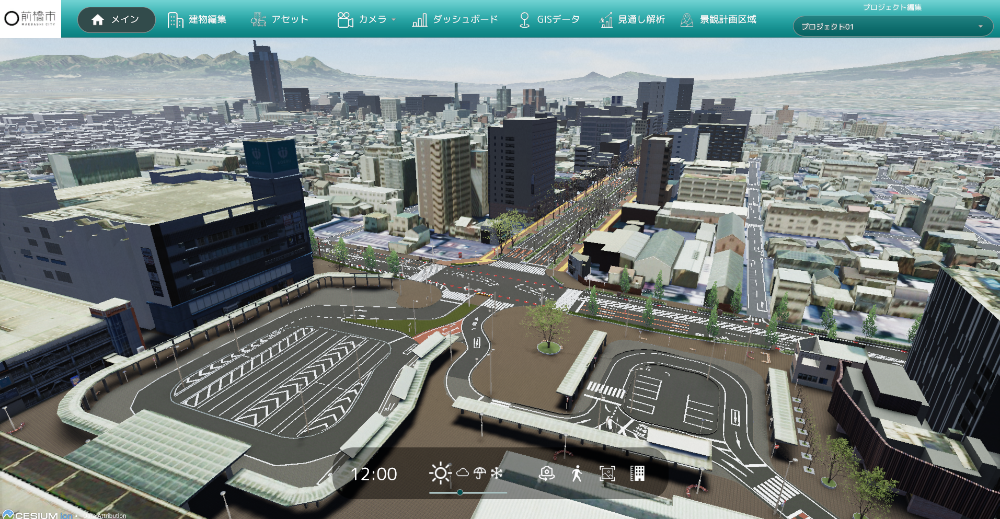

# MaebashiDigitalTwin - 前橋市デジタルツイン

## 1. 概要
本リポジトリでは、前橋市の3D都市モデルを活用した景観まちづくり支援ツール「MaebashiDigitalTwin」のソースコードを公開しています。
`Unity 2022.3.25f1`にて動作確認を行っています。

## 2. 利用手順
本システムの構築手順については[セットアップ手順](./Documentation~/manual/Setup.md)を参照してください。

## 3. システム概要

### 基本操作
- 視点操作はマウスとキーボードで行い、天候や時間帯の変更も可能です。
- 歩行者視点への切り替えや画面キャプチャー機能を備えています。

### 建物編集機能
- 建物の色彩や外観の編集、既存建物の削除が可能です。
- 建物高さの変更機能も提供しています。

### アセット配置機能
- アセットは「樹木」、「広告」、「人」、「乗り物」などに分類され、3D空間上に配置可能です。
- アセットの編集では「位置」、「向き」、「大きさ」の調整が可能です。
- CSVやシェープファイルを用いた一括配置機能も提供しています。

### 視点保存、編集機能
- 俯瞰視点と歩行者視点の両方で視点の保存と編集が可能です。
- 保存した視点は一覧から選択して復元できます。

### ダッシュボード機能
- 交差点の交通量を可視化するヒートマップを表示できます。
- 交差点の交通量を可視化する車両のシミュレーションが可能です。
- 交差点の交通量を可視化する歩行者のシミュレーションが可能です。

### GISデータの読み込み
- ShapeファイルやGeoJSONファイルを読み込み、建物情報とピンを表示できます。

### 景観計画区域の管理
- 景観計画区域の作成、編集が可能です。
- 景観計画区域の色、名前、高さ制限値を設定できます。
- Shapefile形式での景観計画区域の書き出し、読み込み機能も提供しています。

### 見通し解析機能
- 視点場から眺望対象までの見通しを解析し、可視範囲を確認できます。
- 眺望対象から全方位への見通し解析も可能です。

### プロジェクト管理
- プロジェクトの新規作成、保存、読み込み、編集が可能です。

## 4. 動作環境

### 検証済環境

| 項目              | 最小動作環境                | 推奨動作環境              |
|------------------|--------------------------|--------------------------|
| CPU             | Intel クロック周波数 2GHz 以上 | 同左                      | 
| GPU             | NVIDIA® GeForce RTX™ 4060 Laptop GPU | 同左                      | 
| メモリ          | 32GB 以上                 | 同左                      | 
| ストレージ      | 200GB 以上の空き容量       | 同左                      | 
| OS             | Windows 11 Home 64 ビット | 同左                      |

## 5. ライセンス

- ソースコード及び関連ドキュメントの著作権は前橋市に帰属します。
- 本システムの開発は株式会社シナスタジアが行っています。
- 本ドキュメントは[Project PLATEAUのサイトポリシー](https://www.mlit.go.jp/plateau/site-policy/)（CCBY4.0及び政府標準利用規約2.0）に従い提供されています。

## 6. 注意事項

- 本リポジトリは参考資料として提供しているものです。動作保証は行っていません。
- 本リポジトリについては予告なく変更又は削除をする可能性があります。
- 本リポジトリの利用により生じた損失及び損害等について、前橋市と株式会社シナスタジアはいかなる責任も負わないものとします。